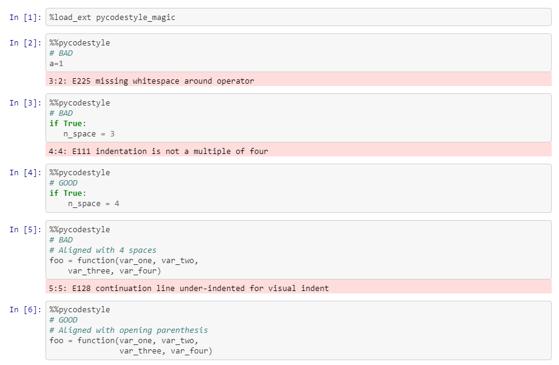
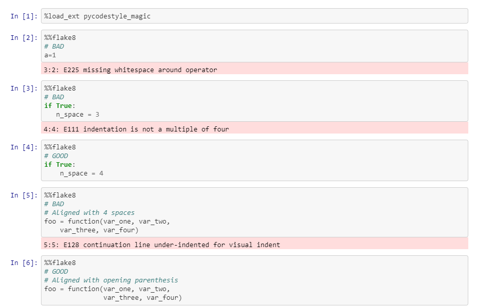

# pycodestyle_magic
Magic function for pycodestyle and flake8 module in Jupyter-Lab or Notebook

# installation
Make sure you've the Python package pycodestyle, flake8 and this pycodestyle_magic.

`pip install pycodestyle flake8`
`pip install pycodestyle_magic`

# usage
Enable the magic function by using the pycodestyle_magic module in a cell

`%load_ext pycodestyle_magic`

and then use the function in your cell to check compliance with `pycodestyle` or `flake8` as such:
`%%pycodestyle`

or for `flake8`

`%%flake8`

See notebooks in notebook directory for example use cases, as such:
### Pycodestyle

### Flake8

Examples notebooks were slightly adapted from
https://github.com/SiggyF/notebooks/blob/master/styleguide.ipynb

